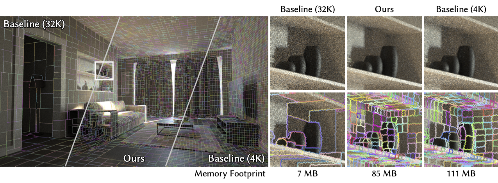
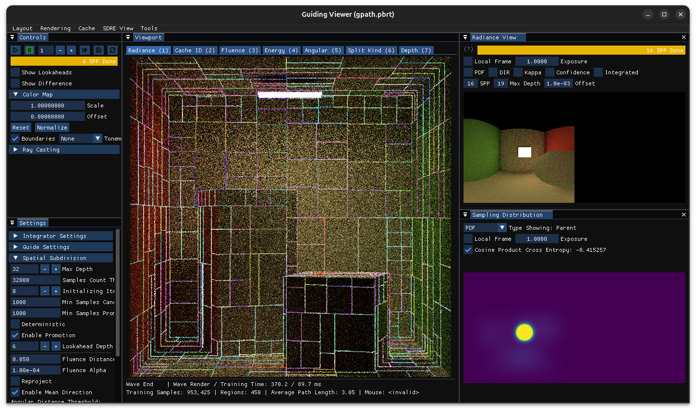

# Illumination-Aware Spatial Subdivision for Path Guiding



This is the repository of the author's implementation of the EGSR 2026 paper [*Illumination-Aware Spatial Subdivision for Path Guiding*](https://spatial-subdiv.ewi.tudelft.nl/).

The proposed spatial subdivision was implemented on a forked version of [Open Path Guiding Library (OpenPGL)](https://github.com/OpenPathGuidingLibrary/openpgl), integrated into their [provided PBRT](https://github.com/OpenPathGuidingLibrary/pbrt-v4). [Here](./README-PBRT.md) is the instruction on how to use PBRT.


## Build Instructions

The build system is managed by CMake. Due to our separation of the two repositories (PBRT and OpenPGL), the compilation boils down to two steps:
- Building and installing OpenPGL (to the location specified by `CMAKE_INSTALL_PREFIX`).
- Building PBRT and linking OpenPGL.

These build steps are automatically managed by the cmake files. You just have to run the following commands in the project directory:

```shell
mkdir build
cd build
cmake .. -DCMAKE_INSTALL_PREFIX=../install
cmake --build .
```

The resulting `pbrt` under `build` is the executable of the renderer. 


## Usage

You can run `path/to/pbrt path/to/scene.pbrt [options]` to render a scene. For ease of invocation, you may run `source setpath.sh` to add the build directory to your `PATH` environment variable so that you can directly run `pbrt` from any directory.

Options for path guiding and the underlyning spatial subdivision are configured in the scene files. `sample_scenes` provides some examples of how to use the proposed spatial subdivision in PBRT scene files. 

For example, `sample_scenes/cbox/ours.pbrt` is a scene file that uses the proposed spatial subdivision, with NEE enabled, parallax-aware VMM (PAVMM) as the directional distribution, mean radiance threshold of 0.05, mean direction threshold of 3 degrees, and false positive split rate (alpha) as 0.0001 (same as paper Sec. 6.1). It then stores the trained guiding cache to `ours.field` after rendering.

To render Cornell Box for 64 samples per pixel (SPP), run
```shell
cd sample_scenes/cbox
pbrt ours.pbrt --spp 64
```

`sample_scenes/cbox/baseline.pbrt` is a scene file that uses the sample-count-based spatial subdivision, with everything else the same as `ours.pbrt`. 

For how to configure the renderer, path guiding, and spatial subdivision, please refer to the comments in `sample_scenes/cbox/ours.pbrt` and `sample_scenes/cbox/baseline.pbrt`.

`sample_scenes/cbox/load_cache.pbrt` demonstrates how to load a pre-trained guiding cache from a file and evaluate the rendering quality of the cache.


## Visualizer

For debugging and inspection purposes, we designed and implemented a visualization tool that can preview the rendering, spatial subdivision, guiding distributions, error statistics, and other useful information on the fly during the rendering process.

It's built by the cmake system by default (see the `PBRT_BUILD_GUIDING_VIEWER` option in `CMakeLists.txt`). 

To run the visualizer, you simply have to enable the `--guiding-viewer` option when you run the `pbrt` command. For the visualizer features to function properly, it is recommended to also set PBRT's render coordinate system to `world`. For instance, to visualize the rendering of `ours.pbrt` with 64 SPP, run
```shell
cd sample_scenes/cbox
pbrt ours.pbrt --spp 64 --guiding-viewer --render-coord-sys world
```

You will see the following window:



Press space or click the start button on the top left to start the rendering. 

You can left click to set a probe in the scene via ray casting. The visualizer will then display the ground truth radiance distribution and the cached guiding distribution at that probe location.

You can also play around with different channels, color maps, settings, and different view modes.


## Development Notes

We briefly described the relevant files for the proposed spatial subdivision.

### OpenPGL

The [path guiding library](https://github.com/JamesZFS/OpenPGL-spatial-subdiv) is linked to PBRT as an external project inside `src/ext/openpgl`.

Main changes were made to the following files:
- `src/ext/openpgl/openpgl/spatial/kdtree/SignatureSTreeBuilder.h`: implementation of the proposed signature-based spatial subdivision scheme.
- `src/ext/openpgl/openpgl/data/Signature.h`: the 24-byte signature (mean radiance and mean direction) data structure. Here the term "fluence" is just an alias to "mean radiance".
- `src/ext/openpgl/openpgl/spatial/Region.h`: data structures required by the guiding cells (called `Region` in the code)
- `src/ext/openpgl/openpgl/spatial/CandidateRegion.h`: extra data required by the lookahead cells (called `CandidateRegion` in the code).

### PBRT

Two path tracer variants were created to integrate path guiding (with our adaptive spatial subdivision) into the render loop.
- `src/pbrt/cpu/integrators.h`: path tracers declarations. `GuidedPathIntegrator` and `GuidedVolPathIntegrator` are the two new path tracers with guiding. (The later works with scenes with partipating media, aka. volume rendering).
- `src/pbrt/guiding/guiding.{h,cpp}` contain supporting functions and implementation for the guided path tracers.
- `src/pbrt/film.{h,cpp}` have been modified to support AoVs for our path guiders. See `GuidedGBufferFilm`.
- `src/pbrt/guiding/` stores the source code for the guiding visualizer.

